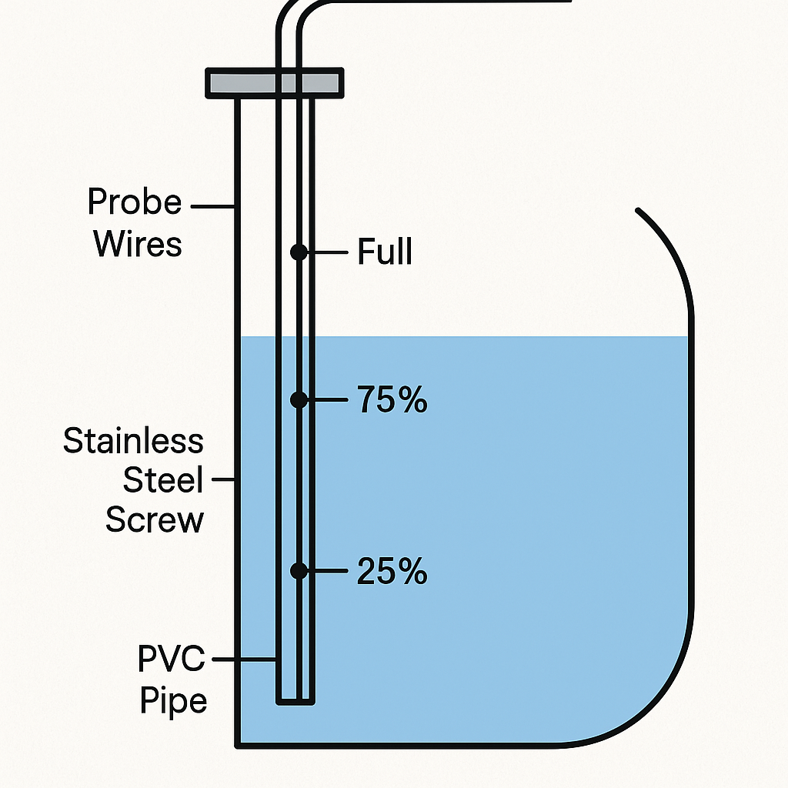
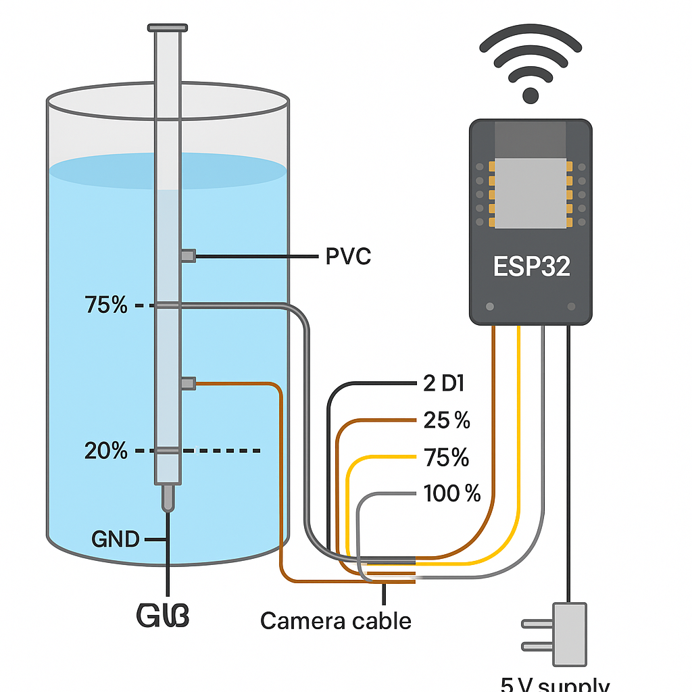

# 🌊 IoT Water Level Indicator

An ESP32-based IoT Water Level Indicator that monitors the water level of an overhead tank and displays it through a web dashboard. The system can also send notifications when the tank becomes full or reaches a low level.

---

## Features

- 📶 Wi-Fi connectivity
- 🌊 Real-time water level monitoring
- 📱 Mobile-friendly dashboard
- 🌐 Logs daily usage in litres
- 🔔 Tank Full notification
- ⚠️ Low Water Level alert and Detects level drop to estimate usage
- ⚡ Low-cost hardware
- 🔋 Runs continuously using a 5V adapter 24/7

---

## Hardware Used

- ESP8266 Development Board 
- Water level probes
- Connecting wires
- 5V Mobile Charger
- Overhead Water Tank

---

## Software

- Arduino IDE
- ESP32 Board Package
- Blynk IoT
- Wi-Fi Library

---

## Project Images

### Complete Setup



### Wiring



---

## Folder Structure

```text
code/
images/
schematics/
docs/
videos/
```

## Working Principle

The ESP32 continuously checks the status of the water level probes installed inside the overhead tank.

Whenever water reaches a probe level, the corresponding GPIO detects the level and updates the web dashboard instantly.

The dashboard can be accessed by any device connected to the same Wi-Fi network.

---

## Future Improvements

- MQTT Support
- Telegram Notifications
- Mobile App
- OLED Display
- Cloud Dashboard
- Historical Data Logging

---

## Author

Arul Kumaran

India

---

## License

MIT License
